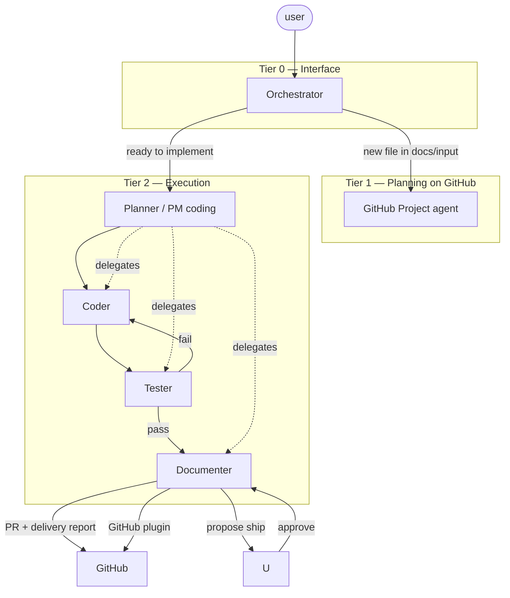
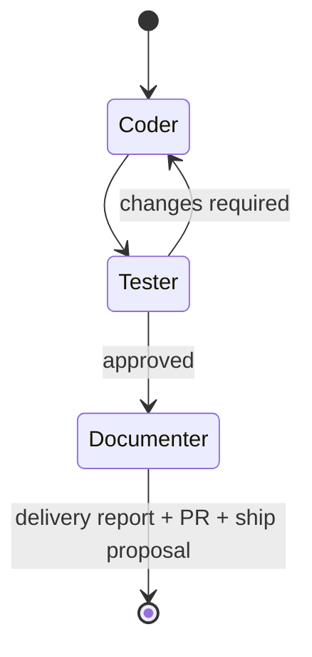
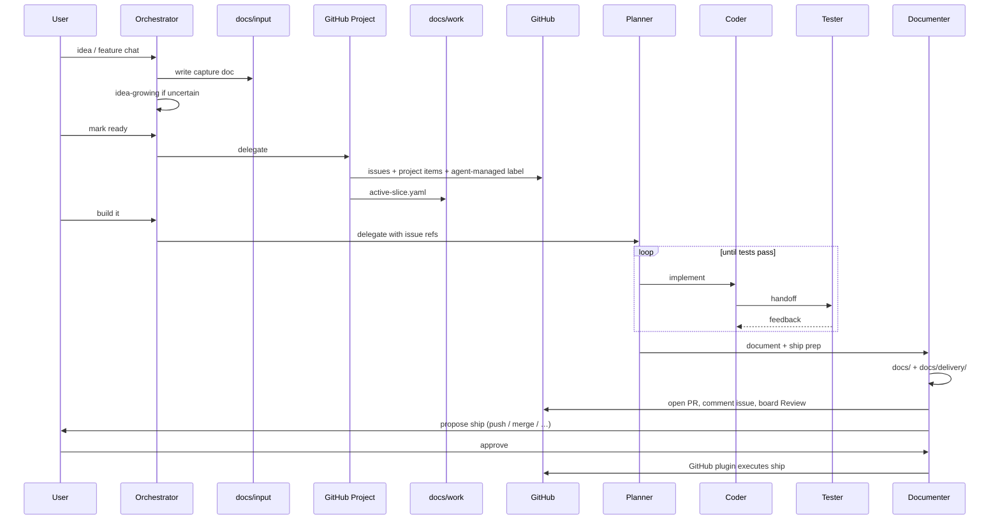

# Agent system

**Repository:** [MathieuLaureti/cooking_website](https://github.com/MathieuLaureti/cooking_website)

| Artifact | Location |
|----------|----------|
| Subagent definitions | `.cursor/agents/` |
| Shared skills (gates, PM, delivery, …) | `~/.cursor/skills/` ( [mlaureti-skill-set](https://github.com/MathieuLaureti/mlaureti-skill-set) ) |
| Work manifest | `docs/work/active-slice.yaml` |
| Feature capture | `docs/input/` |
| Ship packets | `docs/delivery/` |

Talk to the **Orchestrator** in chat; it captures ideas here and delegates after **gate 1** (GitHub issues) and **gate 2** (implementation). App-specific agent skills in this repo: `.cursor/skills/` (`plan-docs`, `recipe-via-mcp`).

The sections below mirror the canonical stack spec (keep in sync when `~/.cursor/docs/agents-system.md` changes materially).

---

The user talks only to the **Orchestrator**. All other agents are delegated; they do not replace the Orchestrator as the conversational entry point.

This repository is the **cooking website** application (console, API, Postgres). Agent subagent stubs live under `.cursor/agents/`; shared skills live in `~/.cursor/skills/` from [mlaureti-skill-set](https://github.com/MathieuLaureti/mlaureti-skill-set). The **Planner** coding loop runs in this tree and updates **`docs/work/active-slice.yaml`** here.

---

## Design principles

1. **Single voice** — User → Orchestrator only. Orchestrator routes work.
2. **Separation of capture vs planning vs execution** — Ideas are rich and unsplit in `docs/input/`. User stories and GitHub data are derived later. Code runs under the Planner loop.
3. **Least privilege** — Each agent has explicit read/write boundaries (see table below).
4. **Skills are shared capital** — **PM** = *project management* playbooks (user stories, issues, boards—not a separate agent). Language and library skills are reused across agents; prompts stay thin.
5. **No coding at the top** — Orchestrator and GitHub Project agent never implement product code.

---

## Hierarchy (who talks to whom)



---

## Agent schema

| Agent | Cursor subagent | User-facing | Writes code | Primary workspace | Invoked by |
|-------|-----------------|-------------|-------------|-------------------|------------|
| **Orchestrator** | `orchestrator` | Yes | No | `docs/input/` | User |
| **GitHub Project** | `github-project` | No | No | GitHub Issues / Project | Orchestrator only |
| **Planner** | `planner` | No* | Coordinates | Target app repo | Orchestrator |
| **Coder** | `coder` | No | Yes | Target app repo | Planner |
| **Tester** | `tester` | No | Tests only | Target app repo | Planner |
| **Documenter** | `documenter` | No | Docs + GitHub ship | `docs/delivery/`, PRs | Planner (after Tester pass) |

\*Planner may surface status back through the Orchestrator thread when the user asks for progress.

### Access matrix

| Path / system | Orchestrator | GitHub Project | Planner | Coder | Tester | Documenter |
|---------------|--------------|----------------|---------|-------|--------|------------|
| `docs/input/` | Read/write | Read only | Read | — | — | Read (context) |
| `docs/work/` (`active-slice.yaml`) | Read | Read/write | Read/write | Read | Read | Read/write |
| `docs/delivery/` | Read | — | Read | — | — | Read/write |
| `docs/` (except `input/`, `delivery/`, `work/`) | Read | Read | Read | Read | Read | Read/write |
| GitHub (issues, PRs, project) | Read; execute ship on user approve | Read/write (stories) | Read | Read | Read | Read/write (ship + propose) |
| Application source | — | — | Read/write | Read/write | Read/write | Read |

---

## Tier 0 — Orchestrator (main agent)

**Role:** Hear prompts, formalize ideas, trigger downstream agents. Acts as critical partner, not a passive scribe.

**Must not:** Implement code, split features into user stories, or edit GitHub without delegating to the GitHub Project agent.

**When a feature or idea is mentioned:**

1. Create or update a file under `docs/input/` (one idea per file when it is a distinct topic).
2. Capture goals, constraints, open questions, risks, and explicit non-goals.
3. Challenge the idea: contradictions, missing requirements, feasibility, scope creep.
4. If the user is uncertain or exploring, enter **idea creation mode** (skill: `idea-growing`).

**Output file template** (Orchestrator uses this inside each `docs/input/*.md`):

```markdown
# Title

## Status
draft | ready-for-github | parked

## Summary
…

## Motivation
…

## Detailed intent
…

## Constraints
…

## Open questions
…

## Risks and criticism
…

## Out of scope
…

## Raw notes
…
```

**Three phases, two gates** (skill: **`delegate-routing`**):

| Phase | What happens | User confirmation |
|-------|----------------|-------------------|
| **1 — Idea** | Capture in `docs/input/`; optional **`/discuss`** (skill: **`documentation-mode`**) — writes **only** `docs/input/`, no GitHub, no coding | — |
| **2 — Planning** | **GitHub Project** creates **many** issues + Project items from input | **Gate 1:** clear yes before issues; then `ready-for-github` |
| **3 — Implementing** | **Planner** loop (coder → tester → documenter) | **Gate 2:** clear yes after issues exist |

Casual wording (“sounds good”, “maybe build”) does **not** pass a gate. In **`/discuss`**, gates are blocked until the user exits discuss mode.

**Input status** (skill: **`intake-capture`**): default **`parked`** for pipeline (ignored for GitHub/build) but still editable in `/discuss`. Promote to **`draft`**, then **`ready-for-github`** only at gate 1.

**Delegation:**

- Gate 1 + `ready-for-github` → **GitHub Project** (`pm-user-stories`, `pm-github-issues`, `pm-project-board`).
- Gate 2 → **Planner** (`technical-decomposition`, manifest, input docs).
- User approves **ship checklist** in main chat → **`ship-approval-relay`** + GitHub plugin (`docs/delivery/`).

**Skills:**

| Skill | Purpose |
|-------|---------|
| `documentation-mode` | `/discuss` — no build, no issues, `docs/input/` only |
| `intake-capture` | Input template, parked/draft/ready-for-github |
| `delegate-routing` | Phase gates and anti-patterns |
| `idea-growing` | Brainstorming, Socratic questions, rational critique, co-design until the idea stabilizes |
| `technology-compare` | Web research; compare tools with pros/cons for all viable options |

---

## Tier 1 — GitHub Project agent

**Role:** Turn stabilized input docs into **user stories**, GitHub **issues**, and **Project** board items. Classic PM hygiene (acceptance criteria, links, labels).

**Must not:** Write application code or edit `docs/input/` (read only).

**Trigger:** Orchestrator only, when a **new** or **updated** file in `docs/input/` is marked `ready-for-github`.

**Skills (planned shared library):**

| Skill | Status | Purpose |
|-------|--------|---------|
| `pm-user-stories` | TODO | INVEST stories, acceptance criteria |
| `pm-github-issues` | TODO | Issue bodies, linking, labels |
| `pm-project-board` | TODO | Columns, status fields, project items |

Orchestrator does not perform this split; this agent owns decomposition for GitHub.

After creating issues, apply label **`agent-managed`** and update **`docs/work/active-slice.yaml`** (skill: **`agent-work-manifest`**).

---

## Work manifest and ignoring manual GitHub items

**Goal:** the user does not create issues manually; the pipeline creates them from `docs/input/`.

**Shared state:** `docs/work/active-slice.yaml` in the **code repo** (monorepo root today) lists the active `input_doc`, issue numbers, branch, PR URL, and delivery report path. Every execution agent reads it so all work targets the **same** issues and PR.

| GitHub item | Agent behavior |
|-------------|----------------|
| Label **`agent-managed`** + listed in manifest | In scope |
| Anything else | **Ignored** for implementation, testing, documentation, and ship |

**Emergency:** To use a hand-created issue, add `agent-managed` and enroll it in the manifest (via Orchestrator or by editing the YAML). Otherwise agents will not touch it.

Skill: **`agent-work-manifest`**.

---

## Repositories: monorepo now, multi-repo later

| Mode | Where manifest lives | Agent definitions / skills |
|------|----------------------|----------------------------|
| **Monorepo (now)** | `docs/work/` in that repo | May live in same repo or in `mlaureti-skill-set` (`~/.cursor/`) |
| **Multi-repo (later)** | **One manifest per code repo** | Pass `repo` + workspace path when delegating; never assume `~/.cursor/docs/work` applies to another clone |

When Planner runs against an app repo, it works in that repo’s tree and updates **that** repo’s `active-slice.yaml`.

---

## Core vs extensions

**Frozen core (6 agents):** `orchestrator`, `github-project`, `planner`, `coder`, `tester`, `documenter`.

**Extensions (you add over time):**

- **Skills** — PM (`pm-user-stories`, …), languages, frameworks, `delivery-report`, `agent-work-manifest`, `doc-style`, `technology-compare`, `project-adoption`, tests.
- **Optional subagents** — e.g. **`project-adoption`** (brownfield alignment plan), `explore`, `ci-investigator`, `bugbot`. Invoked by **Orchestrator** (or Planner for CI); not part of the core six.

Do not add new **core** agents for expertise; add skills or optional subagents.

### Optional: project adoption (brownfield)

When a codebase **predates** this stack, Orchestrator delegates to **`project-adoption`** (`/adopt` or explicit ask). The agent:

1. Inventories the target repo (read-only).
2. Writes **`docs/adoption/<repo-slug>.md`** in `mlaureti-skill-set` with phased alignment and draft issues.
3. Hands off to Orchestrator for optional **gate 1** (create issues) and later **gate 2** (scaffold in target repo via planner).

Skill: **`project-adoption`**. Tool research during planning: **`technology-compare`** (requires web search).

---

## Bypass and shortcuts

| Path | When | Rules |
|------|------|--------|
| **Standard** | Default | `input` → github-project → manifest → Orchestrator “build” → Planner loop |
| **Planner shortcut** | Single small issue already in manifest | Orchestrator may delegate **directly** to `coder` / `tester` / `documenter` without a separate Planner turn, but **Tester must pass before Documenter** and manifest/PR rules still apply |
| **Manual issue** | Emergency only | Not in pipeline until `agent-managed` + manifest enrollment |
| **Maintain agent stack** | Edits to this repo’s agents/skills/docs | Orchestrator may write `docs/` (not `input/`), `.cursor/agents/`, `.cursor/skills/` when the user asks — exception to “no coding” |

---

## Tier 2 — Planner (project manager / coding lead)

**Role:** Own the **implementation loop** on the target repository. Picks work **only** from `docs/work/active-slice.yaml` (issues labeled **`agent-managed`**); ignores all other GitHub issues/PRs. Breaks down technical steps and delegates to Coder, Tester, and Documenter.

**Plan before code:** Planner work starts in **Plan mode** in the main Cursor chat when possible. As a subagent, follow skill **`planner-plan-mode`** (read-only design, trade-offs, delegation outline — no product code until the plan is set). Then run the coding loop.

**Coding loop:**



1. **Coder** — Implement the scoped issue; use language/library skills as needed (feature branch per issue when possible).
2. **Tester** — Verify behavior; loop with Coder until approved; produce structured **Tester handoff** for Documenter.
3. **Documenter** — Evergreen docs; **`docs/delivery/`**; open/update PR via **GitHub plugin** (fallback `gh`); **propose** push/merge to the user; on approval, execute ship via the plugin. Skills: **`delivery-report`**, **`agent-work-manifest`**. Does not own `docs/input/`.

### Ship gate (propose → approve → GitHub extension)

The user does **not** run git manually as the default workflow.

1. **Documenter** finishes the delivery report and opens/updates the PR (draft or ready per policy).
2. **Documenter proposes** a short ship checklist to the user, for example:
   - Push branch (if not on remote)
   - Mark PR ready for review
   - Merge PR (and delete branch)
   - Any follow-up from `docs/delivery/…`
3. User replies **yes** / picks items — that counts as explicit approval (matches “commit only when asked”).
4. **Documenter** (or **Orchestrator** if the user answers in the main chat) executes approved steps via the **GitHub Cursor plugin** (`plugin-github-github` MCP). Prefer MCP over ad-hoc git unless the plugin cannot perform the action.
5. Update `active-slice.yaml` and delivery report `Status` after merge.

**Orchestrator** does not invent ship text; it uses the delivery report and forwards approval to the same GitHub tooling.

**GitHub responsibility split**

| Agent | GitHub role |
|-------|-------------|
| GitHub Project | Create issues and project items from `docs/input/` |
| Documenter | PR, comments, board, **ship proposal**, execute approved ship via GitHub plugin |
| Orchestrator | Relays user approval; runs same plugin actions when user responds in the top-level chat |

**Skills (planned):**

| Agent | Shared / dedicated skills |
|-------|---------------------------|
| Planner | **`planner-plan-mode`**, **`agent-work-manifest`**, `pm-sprint` (TODO) |
| Coder | Language and framework skills (import as needed) |
| Tester | `test-strategy`, CI patterns (TODO) |
| Documenter | **`delivery-report`**, **`agent-work-manifest`**, `doc-style` (TODO) |
| GitHub Project | **`agent-work-manifest`**, `pm-*` (TODO) |

Documenter preferences (do / don't) for evergreen docs will live in `doc-style` once defined.

---

## End-to-end flow



---

## Repository layout (this repo)

```
README.md                 # entry: commands, repo map, links to docs hub
.cursor/
  agents/                 # subagent definitions (*.md)
  skills/                 # repo-specific skills (plan-docs, recipe-via-mcp)
  rules/
docs/
  README.md               # documentation tree hub (link all new docs here)
  agents-system.md        # this file
  input/                  # Orchestrator writes; GitHub agent reads
  delivery/               # Documenter writes; Orchestrator reads for ship
  work/                   # active-slice.yaml — shared issue/branch/PR state
```

Shared stack skills (`documentation-mode`, `delegate-routing`, `delivery-report`, `agent-work-manifest`, `pm-*`, …) live under **`~/.cursor/skills/`** ([mlaureti-skill-set](https://github.com/MathieuLaureti/mlaureti-skill-set)).

Subagent definitions: `.cursor/agents/orchestrator.md`, `.cursor/agents/github-project.md`, `.cursor/agents/planner.md`, `.cursor/agents/coder.md`, `.cursor/agents/tester.md`, `.cursor/agents/documenter.md`, optional `.cursor/agents/project-adoption.md`.

---

## Implementation status

| Piece | Status |
|-------|--------|
| System doc + schema | Done |
| `docs/input/` | Ready |
| `idea-growing` skill | Done |
| Subagent stubs | Done |
| `delivery-report` skill + `docs/delivery/` | Done |
| `planner-plan-mode` skill | Done |
| `agent-work-manifest` + `docs/work/` | Done |
| `docs/skills-roadmap.md` | Done |
| PM skills (`pm-*`) | Done |
| `project-adoption` agent + skill | Done |
| `technology-compare` skill | Done |
| Root `README.md` + doc tree (`doc-style`) | Done |
| Optional subagents + domain skills | Import as needed (`explore`, `ci-investigator`, …) |
| Automated Orchestrator → GitHub trigger | Manual delegation (Orchestrator uses Task tool) |

---

## Glossary

| Term | Meaning |
|------|---------|
| **Feature (chat)** | Something the user describes; captured as one input doc, not necessarily one GitHub issue |
| **User story** | GitHub Project agent output; sized for delivery |
| **Coding loop** | Coder ↔ Tester until pass, then Documenter (docs + PR packet) |
| **Delivery report** | `docs/delivery/*.md` — UI/API/tests + GitHub text; Documenter opens PR |
| **Ship proposal** | Documenter asks user to approve push/merge; execution via GitHub plugin |
| **GitHub plugin** | Cursor GitHub integration (MCP); primary tool for PR/merge/issue actions at ship time |
| **PM skills** | Project-management *skills* (user stories, GitHub issue format)—used by github-project |
| **agent-managed** | GitHub label; marks issues/PRs the pipeline owns |
| **active-slice.yaml** | `docs/work/` — shared issue #, branch, PR for all agents |
