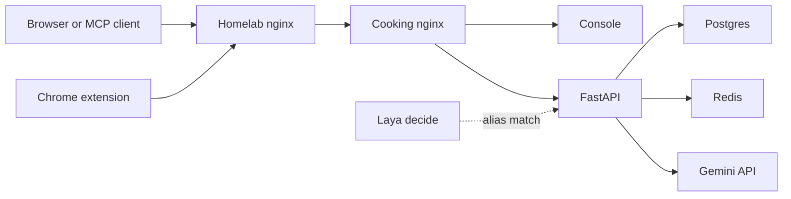

# Architecture

## Runtime map



Browser → nginx (`:81` dev / `:80` prod) → console (Vite/React) or FastAPI server → Postgres (external host) / Redis (`cache`) / Gemini API (recipe URL and image import). The Chrome extension only calls `POST /api/recipe_imports`. Gemini stays on the server. One in-process worker scrapes queued URLs one at a time and leaves the extract in `recipe_url_import` until an admin keeps it. Laya is on the request path only for `POST /api/alias_reviews/match`. The ingredient script calls the same matcher.

Prod is updated by a self-hosted GitHub Actions runner on push to `master` (see [operations.md](operations.md#continuous-deployment-prod)).

### Public homelab path (prod)

The app is published at `https://homelabdu204.ca/recipes/`. Edge nginx (TLS → VPN host → cooking host) uses `location /recipes/` with `proxy_pass http://<cooking-host>:80/`, which **strips** the `/recipes/` prefix. The cooking host (`cw_nginx_prod`) therefore sees `/`, `/assets/…`, and `/api/…`, not `/recipes/…`.

The browser must call **`/recipes/api/…`** on the public site (`API_PREFIX` in the console). MCP clients must use **`/recipes/mcp/`** (Streamable HTTP). **Grok Bot** and **Gemini Spark** use OAuth (`/recipes/.well-known/…`, `/recipes/oauth/*`); CLI/Cursor `mcp.json` may use **`MCP_API_KEY`**. There is **no** edge route for `https://homelabdu204.ca/api/…` or root **`/mcp`** to the cooking stack—only **`/recipes/…`** is forwarded.

```
browser  https://homelabdu204.ca/recipes/api/auth/login
  └─ homelab nginx  (strip /recipes/)
       └─ cw_nginx_prod :80  POST /api/auth/login
            └─ location /api/  → server :6666  POST /auth/login

Grok Bot / Gemini / MCP client  https://homelabdu204.ca/recipes/mcp/
  └─ homelab nginx  (strip /recipes/)
       └─ cw_nginx_prod :80  /mcp/
            └─ location ^~ /mcp  → server :6666  /mcp/  (path preserved)
```

```
browser
  └─ nginx
       ├─ /          → console :6665  (dev proxy) or static dist (prod)
       ├─ /api/      → server  :6666  (prefix stripped)
       ├─ /mcp/      → server  :6666  (MCP streamable HTTP)
       ├─ /oauth/    → server  :6666  (MCP OAuth for Grok Bot / Gemini Spark)
       └─ /.well-known/ → server :6666 (OAuth discovery)
            ├─ Postgres  (DB_HOST, cooking_dev | cooking_main)
            ├─ Redis     (redis://cache:6379/0)
            └─ Gemini API (GEMINI_API_KEY, recipe URL and image import)
```

## Responsibilities

- **console**: Vite + React UI. Match checker and recipe manager, **optimized for mobile** (viewport, touch layout, optional PWA install via header **Mobile**). API calls use `API_PREFIX` from `console/src/api/client.ts`: `/api` in dev, `/recipes/api` in prod (matches homelab routing). Production static assets use Vite `base: '/recipes/'`. PWA manifest + service worker: [features/mobile-pwa.md](features/mobile-pwa.md).
- **server**: FastAPI. Routers, SQLAlchemy async, Alembic, Playwright scrape + Gemini recipe extract, one URL-import worker in the server lifespan, Redis cache-aside for some recipe reads. Prod MCP uses **one gunicorn worker** for Streamable HTTP session affinity (Gemini GET/SSE). That same process runs the import worker.
- **nginx**: Single public port. Static UI (prod) or reverse-proxy to the Vite container (dev). Strips `/api` and forwards to the server. **`/mcp/`** locations disable response buffering for Streamable HTTP / SSE (Gemini).
- **cache**: Redis 7.4, LRU, no persistence. Recipe list/detail cache only.
- **Postgres**: Source of truth for dishes, recipes, match-checker seed data, and the CNF nutrition catalog. Not a compose service; host is `DB_HOST`.

## Request flow

1. UI `apiClient` call via `API_PREFIX` (`/api` dev, `/recipes/api` prod build) with `Authorization: Bearer <token>` (except login/register).
2. On the cooking host, nginx `location ^~ /api/` → `http://server:6666/` (dev: `nginx/default.dev.conf`; prod: `nginx/default.conf`).
3. FastAPI router decodes JWT from the Bearer header (`server/app/auth.py`) — no DB hit on authenticated reads.
4. Async SQLAlchemy session for data access; Redis cache on some recipe GETs.

## Boundaries

- Console does not talk to Postgres, Redis, or the Gemini API. The API key stays on the server.
- Server does not serve the React app.
- Nginx does not interpret JSON; it only routes.
- Match-checker data is read-only over HTTP (no create/update/delete routes).
- **All content routes require a valid JWT.** Only `/health`, `POST /auth/login`, and `POST /auth/register` are public.
- **`/mcp`** is a separate MCP HTTP surface (not under `/api/`). It uses `MCP_API_KEY` (Bearer or `X-MCP-API-Key`), not JWT. See [features/mcp.md](features/mcp.md).
- Admin-only routes (recipe mutations, AI import, registration code) check `role == "admin"` from the JWT.
- Registration codes are HMAC-derived from `JWT_SECRET` + minute bucket — no session store or Redis for auth.
