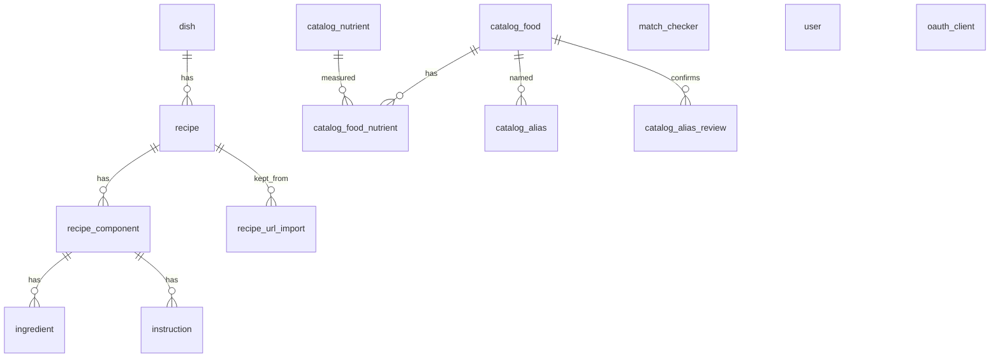

# Data model

Postgres. Source of truth: `server/app/db_models/models.py` and `server/alembic/versions/`.

Two domains share one database: **recipes** (dish → recipe → component → ingredients/instructions) and **match checker** (standalone pairing table). The nutrition catalog is a third domain and does not reference recipe lines.

`ingredient` is a recipe line. It does not point at `catalog_food`. `match_checker`, `user`, and `oauth_client` have no foreign keys to the other domains.

## Tables

### `dish`

| Column | Type | Constraints |
|--------|------|-------------|
| `id` | integer | PK |
| `name` | `varchar(255)` | unique, nullable in schema |

- Relationships: `recipes` → `recipe` (`cascade="all, delete-orphan"` at ORM level).
- Notes: unique name added in `7f2e4e528ece`. The delete-dish API still refuses if any recipe exists; ORM cascade is not a DB `ON DELETE CASCADE` (the cascade Alembic revision is a no-op).

### `recipe`

| Column | Type | Constraints |
|--------|------|-------------|
| `id` | integer | PK |
| `dish_id` | integer | FK `dish.id`, not null |
| `name` | `varchar(255)` | nullable |

- Relationships: `dish`; `components` → `recipe_component` (ORM cascade delete-orphan).
- Notes: create-recipe rejects a duplicate `(dish_id, name)` in application code; there is no unique constraint on that pair.

### `recipe_component`

| Column | Type | Constraints |
|--------|------|-------------|
| `id` | integer | PK |
| `recipe_id` | integer | FK `recipe.id`, not null |
| `name` | `varchar(255)` | nullable |

- Relationships: `recipe`; `ingredients`; `instructions` (both ORM cascade delete-orphan).
- Notes: `name` added in `ba08389779eb`. A recipe is a list of components (e.g. sauce vs dough).

### `ingredient`

| Column | Type | Constraints |
|--------|------|-------------|
| `id` | integer | PK |
| `component_id` | integer | FK `recipe_component.id`, not null |
| `name` | `varchar(255)` | not null |
| `quantity` | `varchar(50)` | not null |
| `unit` | `varchar(50)` | not null |

- Relationships: `component`.
- Notes: `quantity` is a string so values like `"1/2"` work (`7bce26ea193d`). This table is **recipe line items**, not match-checker ingredients.

### `instruction`

| Column | Type | Constraints |
|--------|------|-------------|
| `id` | integer | PK |
| `component_id` | integer | FK `recipe_component.id`, not null |
| `step` | integer | not null |
| `text` | text | not null |

- Relationships: `component`.

### `match_checker`

| Column | Type | Constraints |
|--------|------|-------------|
| `id` | integer | PK |
| `title` | text | indexed, not null |
| `avoid` | `text[]` | not null, server default `{}` |
| `affinities` | `text[]` | not null, server default `{}` |
| `matches` | jsonb | not null, server default `[]` |

- Relationships: none.
- Notes: created in `946b70e36b6f`. `matches` is a list of `[name, score]` pairs (score typically 1–4). Title is indexed, not unique.

### `user`

| Column | Type | Constraints |
|--------|------|-------------|
| `id` | integer | PK |
| `username` | `varchar(64)` | unique, not null |
| `password_hash` | `varchar(255)` | not null (bcrypt) |
| `role` | `varchar(16)` | not null — `admin` or `user` |

- Relationships: none.
- Notes: added in `c3a8f1d92e04`. Passwords stored as bcrypt hashes. First admin bootstrapped from `ADMIN_USERNAME` / `ADMIN_PASSWORD` env vars when the table is empty.

### `oauth_client`

| Column | Type | Constraints |
|--------|------|-------------|
| `id` | integer | PK |
| `client_id` | `varchar(64)` | unique, not null |
| `client_secret_hash` | `varchar(255)` | nullable (bcrypt; null for public clients) |
| `client_name` | `varchar(255)` | nullable |
| `redirect_uris` | JSONB | not null, default `[]` |
| `token_endpoint_auth_method` | `varchar(32)` | not null, default `client_secret_post` |

- Notes: added in `d4e1f0a2b8c3`. Populated by Dynamic Client Registration (`POST /oauth/register`) and optional env bootstrap (`MCP_OAUTH_CLIENT_ID` / `MCP_OAUTH_CLIENT_SECRET`). Authorization codes and refresh tokens live in Redis, not Postgres.

### `catalog_food`

| Column | Type | Constraints |
|--------|------|-------------|
| `id` | integer | PK |
| `source` | `varchar(16)` | not null |
| `external_code` | `varchar(16)` | not null |
| `name_en` | `varchar(255)` | not null |
| `name_fr` | `varchar(255)` | not null |
| `group_code` | `varchar(8)` | nullable |
| `group_en` | `varchar(80)` | nullable |
| `group_fr` | `varchar(80)` | nullable |

- Unique `(source, external_code)`.
- Relationships: `nutrients` → `catalog_food_nutrient`; `aliases` → `catalog_alias` (ORM cascade delete-orphan; DB `ON DELETE CASCADE`).
- Notes: added in `a9c4e2b71f06`. Canadian Nutrient File rows use `source = cnf`. No foreign key to recipe `ingredient`.

### `catalog_nutrient`

| Column | Type | Constraints |
|--------|------|-------------|
| `id` | integer | PK |
| `source` | `varchar(16)` | not null |
| `external_code` | `varchar(16)` | not null |
| `symbol` | `varchar(32)` | nullable |
| `name_en` | `varchar(255)` | not null |
| `name_fr` | `varchar(255)` | not null |
| `unit` | `varchar(32)` | not null |
| `decimals` | integer | nullable |
| `tagname` | `varchar(32)` | nullable |

- Unique `(source, external_code)`.
- Notes: `external_code` is the CNF nutrient code (`208` is kilocalories).

### `catalog_food_nutrient`

| Column | Type | Constraints |
|--------|------|-------------|
| `food_id` | integer | PK, FK `catalog_food.id` `ON DELETE CASCADE` |
| `nutrient_id` | integer | PK, FK `catalog_nutrient.id` `ON DELETE CASCADE` |
| `amount_per_100g` | `numeric(14,6)` | not null |

- Notes: amounts are per 100 g, as published by CNF.

### `catalog_alias`

| Column | Type | Constraints |
|--------|------|-------------|
| `id` | integer | PK |
| `food_id` | integer | FK `catalog_food.id` `ON DELETE CASCADE`, indexed |
| `name` | `varchar(255)` | not null |
| `normalized` | `varchar(255)` | unique, not null |
| `locale` | `varchar(2)` | not null (`en` or `fr`) |

- Notes: seeded from the official English and French food names. `server/scripts/ollama_run.py` and `POST /api/alias_reviews/{id}/accept` also insert a row when a typed string is accepted. An existing `normalized` value is left as-is. `normalized` is lowercase, accents and punctuation removed. Recipe lines do not point here yet. The ingredient script looks up this column before it calls Laya. CNF groups live on `catalog_food.group_en` / `group_fr`. Deeper categories are not tables; the script derives them from commas in `name_en`. See [Ingredient identity](decisions/2026-09-25-ingredient-identity.md#prototype).

### `catalog_alias_review`

| Column | Type | Constraints |
|--------|------|-------------|
| `id` | integer | PK |
| `query` | `varchar(255)` | not null |
| `normalized` | `varchar(255)` | unique, not null |
| `candidates` | `jsonb` | not null. List of `{food_id, name_en, name_fr, probability}` |
| `confidence` | `numeric(6,4)` | nullable |
| `status` | `varchar(16)` | not null, default `pending` (`pending` or `resolved`) |
| `food_id` | integer | nullable FK `catalog_food.id` `ON DELETE SET NULL` |
| `created_at` | `timestamptz` | not null, default now |

- Notes: one row per normalized wording. The script upserts a pending row when Laya's confidence is below `0.75`. Accepting a candidate sets `status` to `resolved` and `food_id`, and inserts `catalog_alias` when that normalized name is new. Migration `b3d8a1c64e20`.

### `recipe_url_import`

| Column | Type | Constraints |
|--------|------|-------------|
| `id` | integer | PK |
| `url` | `varchar(2048)` | not null |
| `normalized_url` | `varchar(2048)` | not null |
| `status` | `varchar(16)` | not null, default `queued` (`queued`, `running`, `ai_wait`, `ready`, `failed`, `kept`, `discarded`) |
| `extract` | `jsonb` | nullable. `RecipeExtract` (`name`, `dish_name`, `components`) once the scrape finishes |
| `error` | text | nullable |
| `recipe_id` | integer | nullable FK `recipe.id` `ON DELETE SET NULL` |
| `created_at` | `timestamptz` | not null, default now |
| `page_text` | text | nullable. Captured body text (max 40k chars) for AI-only retries |
| `structured_ingredients` | `jsonb` | nullable. JSON-LD ingredient strings from Playwright |
| `pipeline_step` | smallint | nullable. `1`–`3` while in progress |
| `ai_attempt_count` | integer | not null, default `0`. Gemini backoff attempts |
| `ai_next_attempt_at` | `timestamptz` | nullable. When to retry step 3 |

- Unique `normalized_url` while `status` is `queued`, `running`, `ready`, or `ai_wait` (`uq_recipe_url_import_active`).
- Notes: the batch worker writes `extract` here and does not insert `dish` or `recipe` until `POST /api/recipe_imports/{id}/keep`. Migrations `c7e1b4a92d10`, `e1a9c4d82f10`.

## Legacy / seed

- File: `server/db.sqlite3`, Django table `api_ingredient` (`title`, `avoid`, `afinities`, `matchs` — original spellings).
- Import: `docker compose exec server python -m app.sqlitetopostgres` (`server/app/sqlitetopostgres.py`).
- Maps JSON text columns onto `avoid` / `affinities` / `matches`. Skips if `match_checker` already has rows.
- CNF catalog: `server/seed/cnf/*.csv` via `python -m app.seed_cnf` (`server/app/seed_cnf.py`). Skips if any `catalog_food` row has `source = cnf`. See [operations](operations.md#schema-and-seed).
