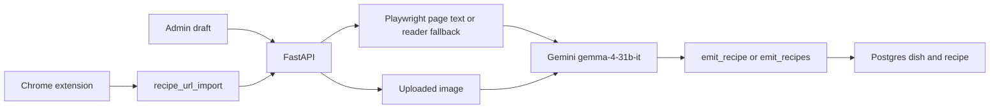

# Gemini recipe extract

Recipe import calls `gemma-4-31b-it` on the Gemini API (`GEMINI_API_KEY` in `.env`) instead of a local Ollama model.

The 31B model does not fit on the 12GB GPU that served the previous 7B and vision models. One hosted model covers page text and recipe photos, and its function-calling returns the recipe as arguments to `emit_recipe`. Thinking is set to `minimal` so import calls stay on the free-tier quota. The key never leaves the server.

The draft form still waits on `GET /api/recipes/recipe_url`, which writes the dish and recipe before it returns. A batch URL from the extension is stored on `recipe_url_import` after Gemini returns. It becomes a dish and recipe only when an admin keeps it.
