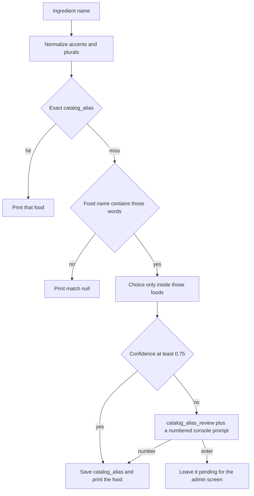

# Ingredient identity

Date: 2026-09-25

The Canadian Nutrient File reference tables and official English/French aliases are loaded by `server/app/seed_cnf.py`. Recipe lines still store a free-text name on `ingredient` and do not point at the catalog. `server/app/ingredient_match.py` resolves one typed name to one catalog food. The admin screen and `server/scripts/ollama_run.py` both call it. A confident match, or a number typed in that console, is saved on `catalog_alias`. An unsure match waits on `catalog_alias_review` for the admin screen. Embeddings are not built. Recipe save does not call this pipeline.

## Context

Recipes mix French and English, and the same ingredient is written many ways. Later features need one id per cooking ingredient. The current `ingredient` row is a line on a component (`name`, `quantity`, `unit` in `server/app/db_models/models.py`), not a shared catalog. Match checker is a separate table and does not share keys with recipe lines.

## Options considered

- Fuzzy string matching across the whole catalog. Slow, and it merges lookalikes such as flour and almond flour.
- A generative model asked, for every name, whether it is in the full inventory. The list grows, and repeats cost a model call.
- Exact alias memory, a short embedding candidate list, then a Choice model only for names not seen before.

## Decision

Add, when this is built, a catalog ingredient and an alias table. Keep the written name on the recipe line for display. Point the line at the catalog id.

Resolve a name in order:

1. Normalize case, accents, and punctuation. Drop measurement notes such as `(1 large)`.
2. If the cleaned name is already an alias, use that ingredient id and stop.
3. Otherwise take the nearest aliases with a multilingual embedding (about 10–30), and add an explicit new-ingredient option. Do not score the name against the full catalog.
4. Run a Choice model in the style of Jev: one winner, a probability per option, and a confidence that means the distribution is peaked, not that the winner is certainly correct. Also ask whether none of the candidates fit.
5. Link and save the alias only when the top option is well above the second and none-of-these is no. Otherwise show a review box with the top candidates and their probabilities. The user’s choice becomes the alias.
6. Do not call the model again for a stored alias.

One catalog row is one cooking ingredient. Salted, dried, or powdered is an attribute. Butter in French and English is one row. Almond flour is not flour. Categories may later limit the shortlist. They do not define identity.

## Prototype

The matcher is `server/app/ingredient_match.py`. The admin name field calls it through `POST /api/alias_reviews/match`. `server/scripts/ollama_run.py` calls the same function and, when unsure, still asks for a number. Laya is `POST http://192.168.2.99:11435/api/decide` (`model: laya`). Run the script inside the dev server container:

```bash
docker compose exec server python scripts/ollama_run.py "beurre salé"
```

A hit prints `{"match": {"id", "name_en", "name_fr", "group_en"}, "confidence"}`. `confidence` is Laya's score for the choice that selected the food. An exact alias, or a shortlist of one food, is `1.0`. A miss prints `{"match": null, "reason": "none", "confidence": null}`. An unsure name prints `{"match": null, "reason": "queued", "confidence": <score>}` and stays on the admin queue unless a number is typed.



Resolve order in the script:

1. `normalize_name` from `server/app/seed_cnf.py` (case, accents, punctuation). `œuf` and `oeuf` become the same string. A trailing `s` also matches the singular (`eggs` matches `egg`).
2. Exact `catalog_alias.normalized` for `source = cnf`. One row returns that food and does not call the model.
3. Otherwise keep only foods whose English or French name contains every query word. The catalog stores `Oeuf`, not a separate ligature form. If no food contains the words, print a miss and do not call the model.
4. One remaining food is saved as an alias for the typed string and printed with confidence `1.0`. An existing normalized alias is not overwritten.
5. Laya chooses only inside that shortlist: CNF group, then comma pieces of `name_en`, then one food. A piece becomes its own option only when it covers at least 8 foods. `raw`, `cooked`, `salted`, `canned`, and `dried` are skipped as category pieces. A choice whose top two probabilities differ by less than 0.08 is treated as no choice.
6. The food is saved as an alias only when that last choice has confidence of at least `0.75`. Otherwise the script stores the top 8 foods on `catalog_alias_review` (`status = pending`) and prints them with numbers. A number saves the alias and marks the row resolved. Enter, or a non-interactive empty stdin, leaves the row pending. The script does not print a low-confidence food as the match.

Categories are computed while the script runs. They are not stored in Postgres. The admin screen (`docs/features/admin.md`) is the waiting list. Accepting a row there writes the same alias.

## Consequences

- First sight of a wording can call Laya. A stored alias is a database read.
- Confidence below `0.75` does not auto-link a food. A person picks from the queued names, in this console or on the admin screen.
- Embeddings and a catalog foreign key on recipe lines are still not built.
