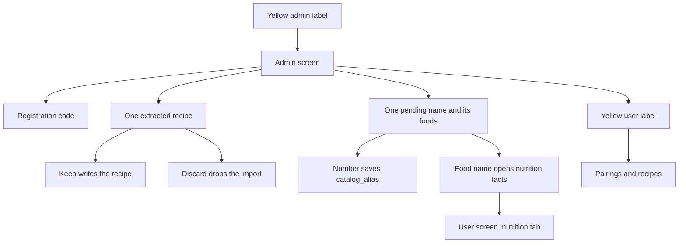

# Admin

## What it does

An admin account has a second screen. It holds the rotating registration code, the alias waiting list, and URL imports that are ready to keep or discard. Pairings and recipes stay on the user screen. Neither queue blocks those screens.

## User flow

1. The header shows the username and, for an admin, a yellow `admin` button with padding so it is a real tap target. A non-admin still sees the yellow role text, and it is not a button. Dev Vite enables the PWA plugin (`devOptions.enabled`) so `virtual:pwa-register` resolves and this screen can load on port 81. The homelab console is the image baked by `nginx/Dockerfile`, so this button is on the public site only after that image is rebuilt.
2. `admin` switches to this screen. The same control then reads `user` and switches back.
3. The registration code stays visible, with its countdown. It is not on the user screen.
4. A name field above the alias queue runs the same matcher as `server/scripts/ollama_run.py`. A recognized name shows the catalog food (click it to open nutrition). An unsure name is written to the waiting list and that row is shown immediately. The list also reloads every few seconds.
5. The number button accepts that food. The API writes `catalog_alias` for the typed string and marks the row resolved. The next pending name replaces it.
6. The food name opens that food in the nutrition checker (amounts per 100 g) and returns to the user screen.
7. **URL imports** sits under the alias queue and refreshes every few seconds. While imports are `queued` or `running`, an **in progress** block lists the URL being extracted (pulsing indicator) and any URLs waiting in queue. The header shows **N in progress** or **idle**. Below that, the oldest **ready** recipe has **Keep** and **Discard**; a **failed** row shows **Retry** and **Discard**.

## UI

- `console/src/App.tsx` — `surface` is `user` or `admin`
- `console/src/components/AdminHome.tsx` — alias queue and URL import review
- `console/src/components/AdminPanel.tsx` — registration code (`embedded` on this screen)
- `console/src/components/MatchChecker.tsx` — `focusFoodId` loads one nutrition food

## Backend

- `POST /api/alias_reviews/match`, `GET /api/alias_reviews`, and `POST /api/alias_reviews/{id}/accept` in `server/app/router/alias_review.py` (`require_admin`)
- `server/app/alias_link.py` — insert alias if `normalized` is new; accept only a `food_id` that is in `candidates`
- Table `catalog_alias_review` in [data model](../data-model.md)

`server/app/ingredient_match.py` writes a pending row when the score is below `0.75`. The script calls that same function, then may still ask for a number in the terminal. See [Ingredient identity](../decisions/2026-09-25-ingredient-identity.md#prototype).

## Edge cases

- Empty queue: the screen says no names are waiting.
- Accepting a food that is not in the list returns `400`. A resolved or missing row returns `404`.
- Clicking a name does not accept it.
- A second run of the same wording updates the pending row. It does not replace an alias that already exists.
