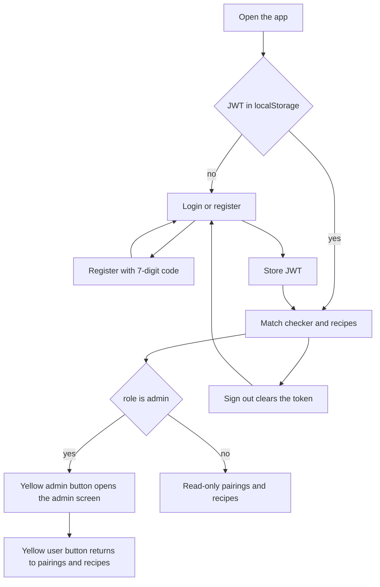

# Authentication

## What it does

Every user must sign in before accessing the app. There is no guest access — match checker and recipes are only available with a valid JWT.

Two roles:

| Role | Access |
|------|--------|
| `admin` | Read everything + create/edit/delete recipes + AI URL import + admin screen (registration code and alias queue) |
| `user` | Read-only: ingredient pairings and recipes |

New accounts register with a **7-digit code** that rotates every 60 seconds. Only admins can see the current code, on the admin screen. The admin shares the code manually to invite new users.

## User flow

1. Visit app → login screen (no content visible).
2. **Register**: username, password (min 6 chars), 7-digit code from admin → account created with `user` role → redirect to login.
3. **Login**: username + password → JWT stored in `localStorage` → full app loads.
4. **Admin** (admin only): the yellow role label is a button. It opens the admin screen and, on that screen, reads `user` and returns here. The registration code and the alias queue live on that screen. See [Admin](admin.md).
5. **Sign out**: clears token, returns to login.

## Bootstrap

On first server start (or whenever `ADMIN_USERNAME` is missing from the DB), if `ADMIN_USERNAME` / `ADMIN_PASSWORD` are set in `.env`, an admin account is created. On subsequent starts the password is synced from `ADMIN_PASSWORD` so `.env` remains the source of truth.

## UI

- `console/src/context/AuthProvider.tsx` — session provider (login, register, logout)
- `console/src/context/auth-context.ts` — `useAuth`, JWT decode from stored token, `isAdmin`
- `console/src/api/client.ts` — `API_PREFIX` (`/api` dev, `/recipes/api` prod), axios interceptor attaches Bearer token; 401 clears token
- `console/src/components/Login.tsx` — sign-in form
- `console/src/components/Register.tsx` — registration form with code field
- `console/src/components/AdminPanel.tsx` — registration code, shown on the admin screen
- `console/src/components/AdminHome.tsx` — admin screen
- `console/src/App.tsx` — auth gate; yellow `admin` / `user` switch for an admin account

## Backend

- Router: `server/app/router/auth.py`
- Auth logic: `server/app/auth.py` — bcrypt passwords, JWT create/decode, HMAC registration codes
- Model: `User` in `server/app/db_models/models.py`
- Bootstrap: `server/app/seed_admin.py` (called on app startup)

### Registration code

Deterministic HMAC from `JWT_SECRET` (or `REGISTRATION_SECRET`) + current minute bucket. No DB or Redis. Accepts current or previous minute (clock-skew tolerance).

## Data

See [data model](../data-model.md) — `user` table.

## Edge cases

- Invalid/expired JWT → `401` on API; client clears token and shows login.
- Wrong registration code → `400`.
- Duplicate username on register → `400`.
- Non-admin hitting admin routes → `403`.
- Registration code refreshes every 60s; previous minute's code still valid briefly.
