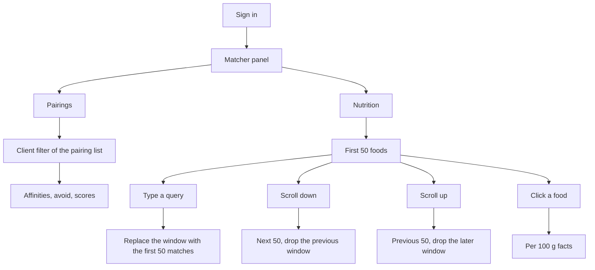

# Match checker

## What it does

Lets you search a seeded catalog of ingredients and see pairing **affinities**, things to **avoid**, and **match scores** (1–4) against other ingredients. The same panel toggles to **Nutrition**, which searches the Canadian Nutrient File and shows amounts per 100 g. Requires login (any role).

## User flow

1. Sign in (see [auth](auth.md)).
2. Page load fetches the short pairing list. Opening Nutrition fetches the first 50 foods.
3. The panel header toggles **Pairings** and **Nutrition**. Switching clears the search and the open record.
4. Clicking the search field or typing focuses this panel (`isActive`). Pairings filter client-side (`includes`, case-insensitive) on `title`; an empty query still shows that full list (A–Z). Nutrition shows one window of 50 foods from `GET /api/nutrition/foods`. An empty query starts at the first food (A–Z). Typing replaces that window with the first 50 matches. Scrolling to the bottom loads the next 50 and drops the previous window. Scrolling to the top loads the previous 50 and drops the later window. The list uses remaining space in the panel; focusing the matcher hides the dish picker and expands this section.
5. Clicking a pairing row loads affinities, avoid, and scored matches. Clicking a food row loads nutrition facts: energy, protein, fat, saturated fat, carbohydrate, sugars, fibre, and sodium first, then the remaining nutrients.
6. Clear returns to search.

Only one of match-checker / recipes is “active” at a time (`console/src/App.tsx`).

## UI

- `console/src/components/MatchChecker.tsx` — Pairings / Nutrition toggle, search, list, detail.
- API calls via `console/src/api/client.ts` with Bearer token. Pairings use `${API_PREFIX}/match_checker`. Nutrition uses `${API_PREFIX}/nutrition`.
- Score colors: 4 orange, 3 gold, 2 light, else muted.
- Nutrition detail is labeled **Per 100 g**. The highlighted rows use CNF codes 208, 203, 204, 606, 205, 269, 291, and 307.

## Backend

- Router: `server/app/router/match_checker.py` — two GET routes, no writes. Nutrition: `server/app/router/nutrition.py` — list and one food, no writes.
- Auth: `Depends(get_current_user)` on both routers.
- Models: `MatchChecker` and `CatalogFood` / `CatalogNutrient` / `CatalogFoodNutrient` in `server/app/db_models/models.py`.
- No Redis, no model calls.

## Data

Table `match_checker`. Seeded from legacy SQLite `api_ingredient` via `python -m app.sqlitetopostgres` (runs on every server container start when the table is empty). Nutrition reads `catalog_food` and `catalog_food_nutrient`, seeded from `server/seed/cnf/` via `python -m app.seed_cnf` when no `source = cnf` food exists. Dev uses DB `cooking_dev`; prod uses `cooking_main` — seed each database separately. See [data model](../data-model.md) and [operations](../operations.md#schema-and-seed).

## Edge cases

- Empty `avoid` / `affinities` / `matches` are valid (many seed rows).
- Unknown pairing `id` → 404; the UI does not surface that as a message.
- Unknown nutrition `food_id` → 404.
- Nutrition keeps only the current 50-food window. `has_more` false means there is no next window. `offset` 0 means there is no previous window. A query that matches nothing shows "No foods match". An empty catalog (seed has not run) shows the same empty state.
- No create/update/delete API; changing pairings or the catalog means a DB write or re-seed.
- Unauthenticated request → 401.
