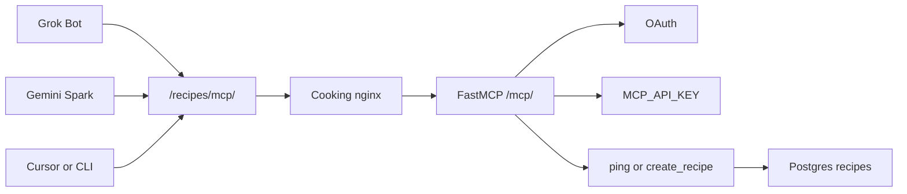

# MCP (recipe create)

External AI clients (**Grok Bot**, Cursor, **Gemini Spark**, Claude Desktop, etc.) can connect to a **Model Context Protocol** server on the same host as the web app. Tools: **`ping`** (connectivity) and **`create_recipe`** (writes to the same Postgres catalog as the admin UI).

## Terminology (tool contract)

| Term | Meaning | Tool field |
|------|---------|------------|
| **Dish** | Main category (e.g. Pasta, Soup) | `dish_name` |
| **Recipe** | One specific preparation under that dish | `recipe_name` |

Components follow the same shape as the HTTP API: name, ingredients (`name`, `quantity`, `unit`), and numbered instruction steps.

## Call path



Grok Bot and Gemini Spark use OAuth (browser sign-in as a Cooking **admin**). A CLI or Cursor `mcp.json` client can send `MCP_API_KEY` instead. All land on the same tools.

## Endpoint URLs

Transport: **Streamable HTTP** (FastMCP). Nginx proxies `/mcp` to the FastAPI mount **without** stripping the path.

| Environment | Public / client URL |
|-------------|---------------------|
| Dev (nginx `:81`) | `http://<host>:81/mcp/` |
| Prod (homelab) | `https://www.homelabdu204.ca/recipes/mcp/` |
| Server direct (debug) | `http://server:6666/mcp/` |

Streamable HTTP works at **`/mcp`** or **`/mcp/`** (cooking nginx proxies both). OAuth protected-resource metadata uses **`…/mcp`** with **no** trailing slash so it matches strict connectors (Grok Bot cloud). Homelab strips `/recipes/` before the cooking nginx; OAuth metadata URLs use the same **`PUBLIC_BASE_URL`** prefix (see [operations.md](../operations.md)).

## Authentication

### Grok Bot (recommended for Cursor plans)

[Grok Bot](https://docs.x.ai/grok-bot) runs in Cursor’s cloud. Connectors are account-wide plugins (not per-Bot). The cooking MCP URL must be on the **public internet** — use prod, not `localhost`.

**MCP server URL:** `https://www.homelabdu204.ca/recipes/mcp` (no trailing slash for Grok Bot; `/recipes/mcp/` also works for transport).

#### OAuth (preferred)

Grok Bot / Cursor Dynamic Client Registration sends these redirect URIs; the cooking OAuth server allows them:

| Surface | Redirect URI |
|---------|----------------|
| Desktop Grok Bot / Cursor | `http://localhost:8787/callback` (and `http://127.0.0.1:8787/callback`) |
| Cloud Agents / web | `https://www.cursor.com/agents/mcp/oauth/callback` |
| Grok Bot cloud | `https://www.cursor.com/bot/mcp/oauth/callback` |
| Legacy custom scheme | `cursor://anysphere.cursor-mcp/oauth/callback` |

1. Open **Marketplace** (or **Settings → Plugins**) in Grok Bot.
2. Add a **custom** MCP connector named e.g. `cooking-recipes` with the prod URL above. Do **not** paste `MCP_API_KEY` if you want the OAuth prompt.
3. Complete the browser login with a Cooking **admin** account (the page title is **Authorize MCP**).
4. In a Bot chat, type `@` and attach **cooking-recipes**. Ask it to call **`ping`**, then **`create_recipe`**.

If DCR fails with `redirect_uri not allowed`, add the missing callback to `MCP_OAUTH_EXTRA_REDIRECT_URIS` and recreate the server container.

#### API key (fallback)

Same URL, plus a static header (Grok Bot Plugins form, or ask the Bot to add the connector with a header). Use the value of `MCP_API_KEY` from `.env`:

- `Authorization: Bearer <MCP_API_KEY>`

This skips OAuth. Prefer OAuth so the Bot does not hold the shared key.

This is **Grok Bot**, not [grok.com custom connectors](https://docs.x.ai/grok/connectors). grok.com is a different OAuth client; capture its DCR `redirect_uris` and put them in `MCP_OAUTH_EXTRA_REDIRECT_URIS` if you connect that surface.

### Gemini Spark (consumer)

[Gemini Spark custom apps](https://support.google.com/gemini/answer/17209137) require **OAuth 2.0**, not a static API key.

1. On the web: **Settings & help → Connected Apps → Custom apps for Spark**.
2. MCP server URL: **`https://www.homelabdu204.ca/recipes/mcp/`**
3. Leave **Advanced features** collapsed if **Dynamic Client Registration** succeeds; otherwise set **Client ID** / **Client secret** from `MCP_OAUTH_CLIENT_ID` / `MCP_OAUTH_CLIENT_SECRET` in `.env`.
4. Complete the browser login (**admin** Cooking account only).
5. Use the connected app only in **Gemini Spark** (not the default Gemini chat). Start a **new Spark task** and ensure the custom app is in scope for that task.
6. **Google account:** personal account, [Spark eligibility](https://support.google.com/gemini/answer/17209137), **Keep Activity** enabled, English UI.

### “Connected” but the model cannot call tools

| Symptom | Likely cause |
|---------|----------------|
| Model says tools are not in this session | Chat is **not Spark**, or Spark task without the custom app attached |
| Same message in **Cursor IDE** | Cursor has no MCP server configured for this URL (use Grok Bot Plugins + OAuth, or `MCP_API_KEY` in `mcp.json`) |
| Grok Bot plugin will not authenticate | OAuth DCR rejected a redirect URI, or login used a non-admin Cooking account. Check `docker compose logs server` for `redirect_uri not allowed` |
| Logs show `tools/list` but no `tools/call`, and Spark prints a JSON payload | Google listed the tool but Gemini rejected the schema. FastMCP already inlines nested models; the field Spark cannot register is `additionalProperties` (also `$ref` / `$defs` if they appear). Redeploy, start a **new** Spark chat, and ask it to call **ping** then **create_recipe**. |
| Server logs `MCP JSON-RPC method=tools/call` | Tool reached the server; check response / admin auth |
| Only `initialize` (small POST) and GET 200s | Spark opened a session and never listed or called tools. Grep `MCP JSON-RPC` in `docker compose logs server`. |

Server logs go to gunicorn’s error logger (`uvicorn.error`), so they show up in `docker compose logs`. Each POST logs `MCP JSON-RPC method=…`, then `MCP POST /mcp/ status=… content-type=… session=…`, then `MCP POST finalized status=… bytes=… sanitized=…`. `sanitized=True` means `$ref` / `additionalProperties` were stripped. Every completed POST is sent with `Content-Length` set to that final size. Grep `tools/call` while testing.

### Spark checklist (transport, schema, cache)

| Spark concern | This stack |
|---------------|------------|
| **Path / transport** | **Streamable HTTP** at `https://…/recipes/mcp/` (trailing slash). Not legacy `/sse` or `/messages` paths. |
| **SSE / proxy** | Cooking nginx: `proxy_buffering off`, 300s timeouts. **Also** set 300s + buffering off on homelab edge `/recipes/` (see [operations.md](../operations.md#edge-nginx-homelab)). |
| **JSON Schema** | `create_recipe` uses flat types (no `anyOf`). FastMCP inlines nested models, but every object still carries `additionalProperties: false`, which Gemini's function-calling API rejects. On `tools/list` the server removes `additionalProperties`, `title`, `default`, and `$schema`, and inlines any `$ref` / `$defs`. Tool-level `_meta`, `title`, `outputSchema`, and `annotations` are removed too. Each completed POST is given a `Content-Length`, because the homelab edge speaks HTTP/1.0 to cooking nginx. |
| **OAuth scope** | Metadata includes `ACCESS_VIEW_MANAGE_MCP_CONTENT` + `mcp` + `offline_access`. **Re-link** Connected App after scope changes. |
| **Stale session** | Start a **new Spark chat** after server deploy or re-authorize; tool list is fixed at session init. |
| **Firewall** | Google egress must reach `homelabdu204.ca:443`; allow Google IP ranges on OPNsense if filtered. |

`GET /mcp/` **200** with `mcp-session-id` means the SSE leg works; if the model still lists only Workspace/search tools, Spark did not bind custom tools—re-link app and new chat.

OAuth discovery (RFC 9728 / 8414):

| Document | Public URL |
|----------|------------|
| Protected resource metadata | `https://www.homelabdu204.ca/recipes/.well-known/oauth-protected-resource` |
| Authorization server metadata | `https://www.homelabdu204.ca/recipes/.well-known/oauth-authorization-server` (same JSON at `…/openid-configuration`) |

Unauthenticated MCP requests return **401** with `WWW-Authenticate: Bearer resource_metadata="…"`.

OAuth redirect URIs allowed at DCR (exact or prefix): Gemini Spark `https://oauth-redirect.googleusercontent.com/r/…`, Gemini Enterprise `https://vertexaisearch.cloud.google.com/oauth-redirect`, Cursor/Grok Bot callbacks above, plus `MCP_OAUTH_EXTRA_REDIRECT_URIS`. DCR does not accept arbitrary URIs just because they appear in the registration body.

### CLI / Cursor IDE (`mcp.json` API key)

Set `MCP_API_KEY` in `.env`. Send on each request:

- `Authorization: Bearer <MCP_API_KEY>`, or
- `X-MCP-API-Key: <MCP_API_KEY>`

OAuth and API key can both be enabled.

## MCP Inspector (pre-flight)

Before debugging Gemini Spark, verify the public URL and tools with the repo wrapper around [MCP Inspector](https://modelcontextprotocol.io/docs/tools/inspector):

```bash
./scripts/mcp-inspector.sh probe
```

See [tools/mcp-inspector/README.md](../../tools/mcp-inspector/README.md) and [operations.md](../operations.md#mcp-inspector-debug). Uses **`MCP_API_KEY`**, not Spark OAuth.

## Gemini CLI (API key)

[Gemini CLI](https://github.com/google-gemini/gemini-cli) supports Streamable HTTP with headers:

```json
{
  "mcpServers": {
    "cooking-recipes": {
      "httpUrl": "https://www.homelabdu204.ca/recipes/mcp/",
      "headers": { "Authorization": "Bearer YOUR_MCP_API_KEY" },
      "timeout": 60000
    }
  }
}
```

## Implementation

Prod gunicorn runs **one worker** so Streamable HTTP **sessions** (POST + **`GET` SSE** with `mcp-session-id`) stay in-process. The MCP app uses **stateful** Streamable HTTP (`stateless_http=False`) because **Gemini** opens a **GET** event stream after an authenticated **POST**; stateless mode returns **405** on GET.

**Auth:** `POST` requires Bearer (OAuth MCP token or `MCP_API_KEY`). **`GET`/`DELETE`** with a valid **`mcp-session-id`** (from the prior POST) are allowed without repeating Bearer — the session was bound at POST time.

**Gemini reachability:** Google may send **`HEAD /mcp/`** without a Bearer token. The server answers **`200`** (still includes `WWW-Authenticate` with OAuth metadata). **`POST`** / streamable GET require OAuth or `MCP_API_KEY`. Nginx disables **`proxy_buffering`** / **`proxy_cache`** on `/mcp` for SSE/streaming.

Tool input schema uses flat models in `server/app/mcp_tool_models.py` (`extra=forbid`) for client compatibility.

- MCP module: `server/app/mcp_server.py`
- OAuth AS: `server/app/router/mcp_oauth.py`
- Mounted in: `server/app/main.py` at `/mcp`
- Persists via: `_create_recipe_in_db` in `server/app/router/recipes.py`
