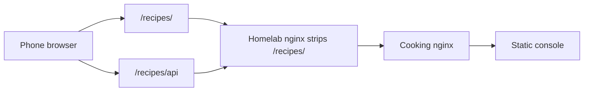

# Mobile and PWA

The cooking console is built for **phones and tablets**, not only desktop. Match checker and recipe manager use a single-column layout, touch-friendly panels, and a viewport meta tag. **Installing the site as a Progressive Web App (PWA)** gives a home-screen icon and full-screen experience without an app store.

## Why mobile matters

- **Kitchen use:** look up pairings and recipes on a phone while cooking.
- **Same account:** JWT login works in the installed PWA; API calls use the same `/recipes/api` prefix as the browser (prod homelab).
- **Gemini Spark / Grok Bot:** MCP/OAuth is separate from the PWA; the phone app is the React console only.

Treat mobile regressions (layout, auth, API prefix, install flow) as **release blockers** alongside desktop.

## Public URL (prod)

Open and install from:

`https://www.homelabdu204.ca/recipes/`

Homelab nginx strips `/recipes/` before the cooking stack; the **browser** must keep `/recipes/` in the address bar so assets, the service worker, and API paths stay aligned.

## Install from the UI

After login, the header shows a discrete **Mobile** control next to **Sign out**:

- **Chrome (Android/desktop):** when the browser fires `beforeinstallprompt`, **Mobile** triggers the native install dialog.
- **Safari (iOS):** **Mobile** explains **Share → Add to Home Screen** (Apple does not expose a programmatic install API).
- **Already installed:** the button hides when running in standalone display mode.

## PWA technical checklist

| Piece | Location / behavior |
|-------|---------------------|
| Web app manifest | Generated at build time (`vite-plugin-pwa`); `start_url` and `scope` use `/recipes/` in prod builds |
| Service worker | Precaches shell assets; `registerType: autoUpdate` |
| Icons | `console/public/pwa-192x192.png`, `pwa-512x512.png`, `apple-touch-icon.png` (generated in `prebuild`) |
| Theme / display | `#4A594D` theme and background; `display: standalone` |
| HTTPS | Required for service workers (homelab TLS) |

Implementation: `console/vite.config.ts`, `console/src/main.tsx` (SW registration), `console/src/components/MobileInstallButton.tsx`.

## Dev

- Vite dev server: `http://localhost:6665/` (base `/`, API via proxy).
- PWA manifest scope is `/` in dev; prod build uses `/recipes/`.

Rebuild **nginx** (static console) after console changes: `docker compose -f docker-compose.prod.yml build nginx && … up -d nginx`.
