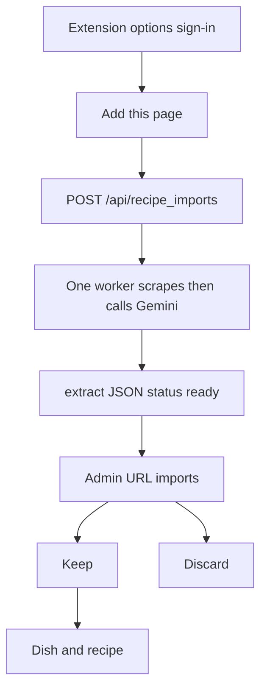

# Recipe URL queue

## What it does

A Chrome extension sends the current page to the cooking site. The server scrapes and extracts that page in the background, one URL at a time, and stores the result on `recipe_url_import`. It does not create a dish or a recipe until an admin presses **Keep** on the admin screen.

The draft form still uses `GET /api/recipes/recipe_url` and waits. That call writes the recipe before it returns. This queue is the other path.

## User flow

1. Load `extension/` as an unpacked extension. The options page stores the site base (default `https://www.homelabdu204.ca/recipes`) and an admin JWT from `POST /api/auth/login`.
2. On a recipe page, open the extension and press **Add this page**. The popup posts the tab URL and shows `Queued` or `Already queued|running|ready`. It does not wait for the scrape.
3. The server worker claims the oldest `queued` row, sets `running`, and calls `RecipeExtractor.from_url`. Success stores the extract and sets `ready`. Failure stores the error and sets `failed`. The next row starts only after that finishes. `from_url` also refuses to run beside a draft-form URL import.
4. On the admin screen, **URL imports** shows how many rows are still extracting and the oldest ready recipe. **Keep** writes it with the same dish match as URL import. **Discard** drops a ready or failed row. A failed row offers **Retry** (same queue row, extraction runs again) and **Discard**, not **Keep**.

## UI

- `extension/manifest.json`, `extension/popup.html`, `extension/popup.js`, `extension/options.html`, `extension/options.js`
- `console/src/components/AdminHome.tsx` — polls `GET /api/recipe_imports` every few seconds

## Backend

- `POST /api/recipe_imports`, `GET /api/recipe_imports`, `POST /api/recipe_imports/{id}/keep`, `POST /api/recipe_imports/{id}/discard`, `POST /api/recipe_imports/{id}/retry` in `server/app/router/recipe_import.py` (`require_admin`)
- `server/app/recipe_import_worker.py` — started from the FastAPI lifespan in `server/app/main.py`. Startup sets leftover `running` rows back to `queued`.
- `RecipeExtractor.from_url` in `server/app/scripts/extract.py` holds one asyncio lock for the scrape and the model call. Playwright loads the page first; if the body text is too short or looks like a bot wall (for example Cloudflare), the server fetches through the Jina reader proxy (`r.jina.ai`) with up to three attempts (short backoff) before calling Gemini. If both paths fail, the error message includes Playwright and reader details.
- Table `recipe_url_import` in [data model](../data-model.md)

## Edge cases

- The same normalized URL (no fragment, no trailing slash) is not queued twice while it is `queued`, `running`, or `ready`.
- Discard is rejected while a row is still `queued` or `running`.
- Keep is rejected unless the row is `ready`. A duplicate recipe name on that dish returns `400` and leaves the row ready.
- A server restart does not drop queued URLs. A row left `running` is queued again.
- Missing `GEMINI_API_KEY`, a scrape error, or a model error sets `failed` and shows the message on the admin card.
