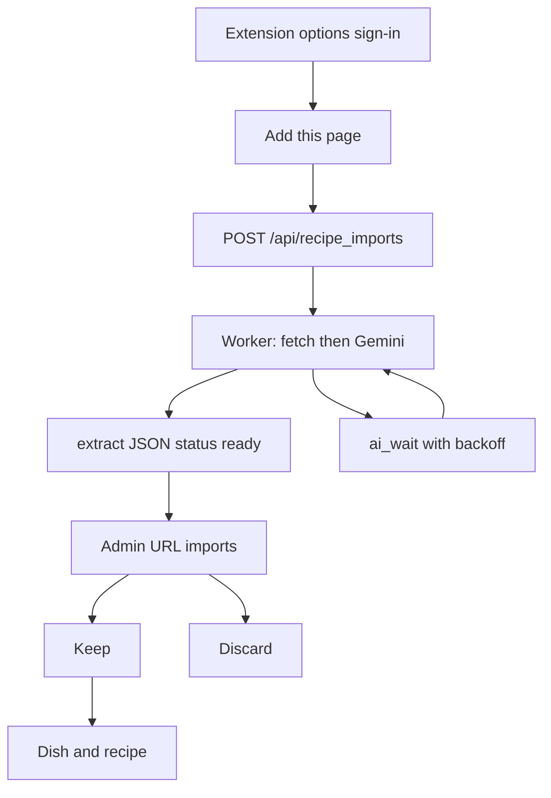

# Recipe URL queue

## What it does

A Chrome extension sends the current page to the cooking site. The server scrapes and extracts that page in the background, one URL at a time, and stores the result on `recipe_url_import`. It does not create a dish or a recipe until an admin presses **Keep** on the admin screen.

The draft form still uses `GET /api/recipes/recipe_url` and waits. That call writes the recipe before it returns. This queue is the other path.

## User flow

1. Load `extension/` as an unpacked extension. The options page stores the site base (default `https://www.homelabdu204.ca/recipes`) and an admin JWT from `POST /api/auth/login`.
2. On a recipe page, open the extension and press **Add this page**. The popup posts the tab URL and shows queue status. It does not wait for the scrape. When the active import cap is reached, POST returns **409**.
3. The worker claims the oldest `queued` row or a due `ai_wait` row, sets `running`, and runs three pipeline steps: **1/3** Playwright (or Jina fallback), **2/3** page text saved to Postgres, **3/3** Gemini on cached text. Success → `ready`. Hard fetch failure → `failed`. Transient Gemini errors (503) → `ai_wait` with exponential backoff (5 / 10 / 20 minutes) without re-scraping; the worker continues other URLs. Interactive draft URL import uses the same Gemini scheduler with higher priority than the worker.
4. On the admin screen, **URL imports** shows step labels (`N/3 …`) for in-progress rows, including **3/3** while waiting on the model. **Keep** / **Discard** / **Retry** behave as before; **Retry** skips scrape when `page_text` is still stored.

## UI

- `extension/manifest.json`, `extension/popup.html`, `extension/popup.js`, `extension/options.html`, `extension/options.js`, `extension/import-status.js`
- `console/src/components/AdminHome.tsx` — polls `GET /api/recipe_imports` every few seconds

## Backend

- `POST /api/recipe_imports`, `GET /api/recipe_imports`, `POST /api/recipe_imports/{id}/keep`, `POST /api/recipe_imports/{id}/discard`, `POST /api/recipe_imports/{id}/retry` in `server/app/router/recipe_import.py` (`require_admin`)
- `server/app/recipe_import_worker.py` — resumable pipeline; started from the FastAPI lifespan in `server/app/main.py`. Startup sets leftover `running` rows back to `queued`.
- `app/gemini_scheduler.py` — priority queue for Gemini (interactive before background).
- `RecipeExtractor` in `server/app/scripts/extract.py`: Playwright scrape lock separate from Gemini; JSON-LD ingredients when HTML is available; Jina reader fallback when needed.
- Table `recipe_url_import` in [data model](../data-model.md). Env `RECIPE_IMPORT_MAX_ACTIVE` (default **25**).

## Edge cases

- The same normalized URL is not queued twice while it is `queued`, `running`, `ready`, or `ai_wait`.
- Discard is rejected while a row is still `queued` or `running`. `ai_wait` rows can be discarded.
- Keep is rejected unless the row is `ready`.
- A server restart re-queues rows left `running`; cached `page_text` is kept for resume.
- After three Gemini backoff cycles, status becomes `failed`.
