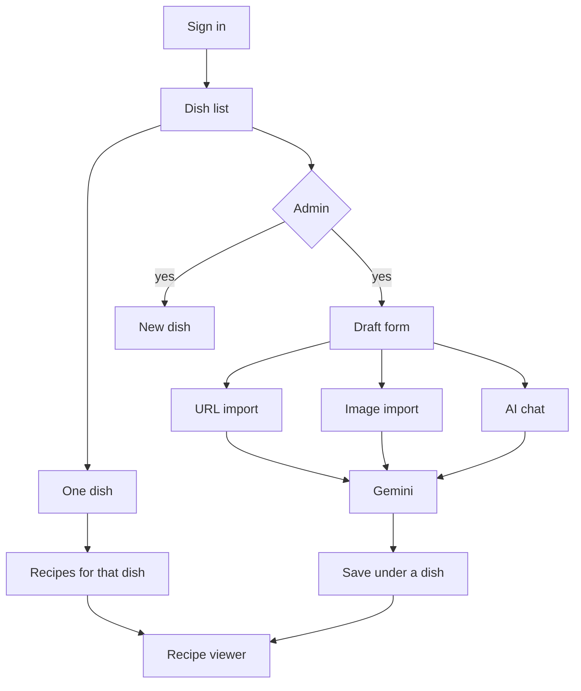

# Recipes

## What it does

Catalog of **dishes**, each with one or more **recipes**. A recipe is a list of **components** (named sections), each with ingredients (`name`, `quantity` string, `unit`) and numbered instructions. Requires login. Only **admins** can create, edit, delete, or import via AI.

## User flow

1. Sign in (see [auth](auth.md)).
2. Load dish list (A–Z); click or type in the search field to open matches (empty query shows all dishes A–Z). The picker uses remaining vertical space; focusing it expands the recipe panel and hides the matcher list.
3. **Admin only**, on the dish list: “+ New Dish” posts a name. “+ Create Recipe” opens the draft with no dish selected. URL or image import sends the current dish names to the model; the server attaches the recipe to a matching dish or creates one. Manual save uses the dish name field the same way.
4. Select a dish → list that dish’s recipes. **Admin only**: **Rename** (confirm + inline name), **Delete** (confirm; disabled while recipes exist), **+ Create Recipe**.
5. **Admin only**: draft form with URL scrape, image upload, and an AI chat, edit, submit.
6. Select a recipe → viewer. **Admin only**: edit and two-step delete.

## UI

- `console/src/components/RecipeManager.tsx` — dish/recipe search; admin create controls gated by `isAdmin`.
- `console/src/components/RecipeDraftForm.tsx` — form plus URL import, image upload, and an AI chat (admin only). The chat starts as a single input ("ask ai" tooltip) and expands into a scrollable message list. When the model returns several versions, a slider (◀ name counter ▶) switches between them; the editing form tracks the active version. The draft scrolls inside the recipe panel with the same thin scrollbar as the rest of the app.
- `console/src/components/RecipeViewer.tsx` — read view; edit/delete hidden for non-admins.
- Types: `console/src/components/types.ts`. Recipe HTTP calls use `API_BASE` (`${API_PREFIX}/recipes`; prod `API_PREFIX` is `/recipes/api`).

## Backend

- Router: `server/app/router/recipes.py`.
- GET routes: any authenticated user (`Depends(get_current_user)`).
- POST/PUT/DELETE + `GET /recipe_url` + `POST /recipe_image`: admin only (`Depends(require_admin)`).
- Cache-aside (`server/app/cache.py`): `dishes:all`, `dish_recipes:{dish_id}`, `full_recipe:{recipe_id}` (1h). Dish and recipe writes delete the keys they change.
- Import: `RecipeExtractor` in `server/app/scripts/extract.py`. Playwright loads the page; Gemini (`GEMINI_API_KEY`, `GEMINI_MODEL`) returns the recipe through the `emit_recipe` function. With no `dish_id`, the prompt includes existing dish names and the server matches on a case-insensitive, accent-stripped name, or inserts a new dish in the same transaction. The draft form still waits on `GET /api/recipes/recipe_url`, which writes the recipe before the response. Batch URLs from the browser extension do not write until an admin keeps them. See [Recipe URL queue](recipe-import.md).
- Chat: `POST /recipe_chat` sends the conversation history plus the current draft to the same Gemini model, which replies with text and zero or more recipe versions through the `emit_recipes` function. The dish list with ids is included so the model can set `dish_id` for an existing dish or `dish_name` for a new one.

## Data

See [data model](../data-model.md). Hierarchy: dish → recipe → recipe_component → ingredient / instruction.

## Edge cases

- Duplicate dish name → 400. Duplicate recipe name on the same dish → 400.
- Non-admin API writes → 403.
- Import with a `dish_id` always saves on that dish. Import without one matches or creates from `dish_name`.
- Chat returns zero or more versions; the slider switches between them. Manual edits to a version persist when navigating away and back.
- Missing `GEMINI_API_KEY`, scrape failure, or a model error → 500.
- URL scrape can take tens of seconds; nginx read timeout is 300s. `from_url` runs one scrape at a time, including the batch worker.
- Image upload accepts jpeg, png, webp, and gif, up to 10MB.
